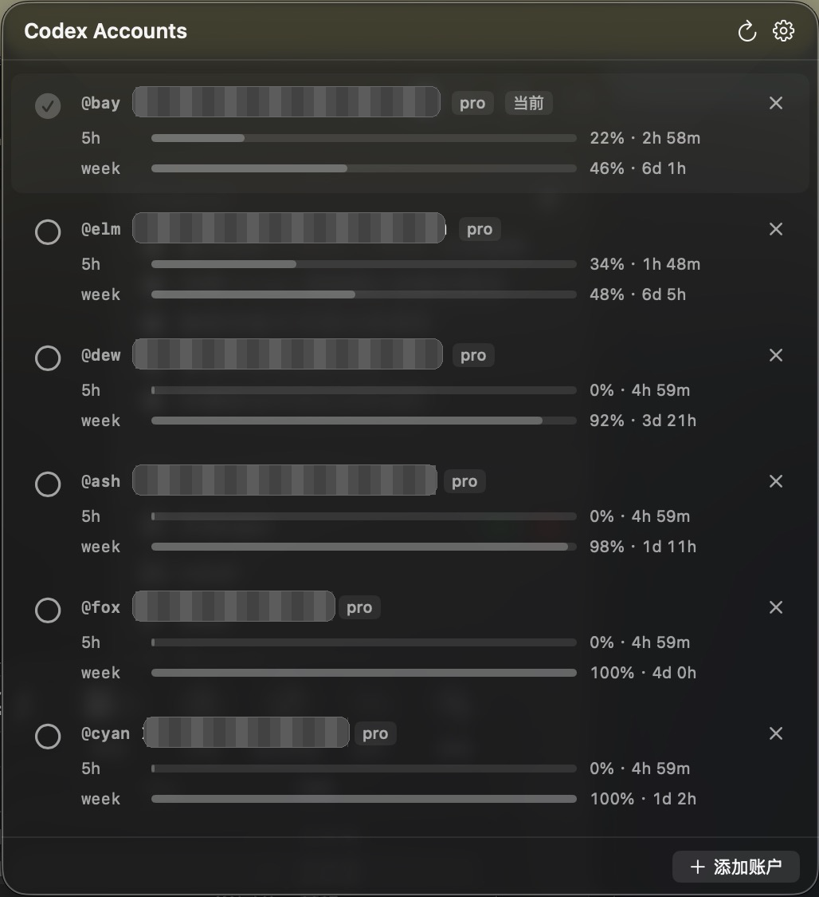
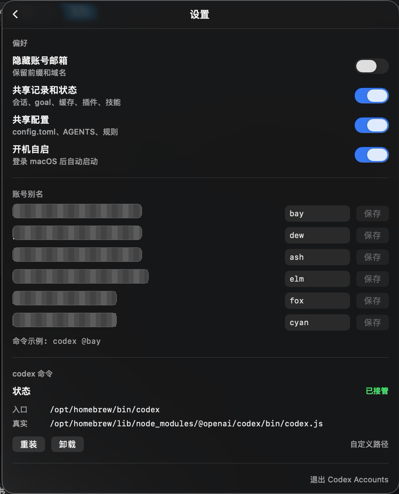

# Codex Accounts

macOS 状态栏里的 Codex 账号切换工具。

它管理多个 Codex CLI 登录环境，让下一次启动的 `codex` 使用你选中的账号。

非 OpenAI 官方项目。

## 截图

<p>
  
  
</p>

## 特性

- 多账号登录和移除。
- 一键切换当前账号。
- 支持账号别名和 `codex @alias`。
- 自动接管现有 `~/.codex/auth.json`。
- 显示每个账号的用量和重置时间。
- 账号按当前账号、剩余额度排序。
- access token 过期时自动刷新。
- 可隐藏账号邮箱。
- 可共享会话、goal、状态、技能、插件和缓存。
- 可共享 `config.toml`、`AGENTS.md`、规则和提示词。
- 可安装/卸载 `codex` shim。
- 检测到正在运行的 `codex` 进程时，可选择继续切换或结束后切换。

## 不影响 Codex App

Codex Accounts 不修改 Codex App 本体。

它只管理命令行 `codex` 的启动环境：

- 不改 Codex App 的应用包。
- 不注入 Codex App 进程。
- 不影响已经运行的 `codex` 进程。
- 只影响通过被接管入口启动的新 `codex` CLI 进程。

切换账号的含义是：下一次启动 `codex` 时使用哪个 `CODEX_HOME`。

## 指定账号启动

默认使用当前账号：

```bash
codex
```

指定账号：

```bash
codex @ash
```

查看账号：

```bash
codex @
```

固定当前 shell：

```bash
export CODEX_ACCOUNT=ash
codex
```

传给 Codex 的参数会原样保留：

```bash
codex @ash resume 019e2687-3131-7611-9fe6-42492e52c32a
```

## 数据位置

账号数据保存在：

```text
~/.codex.accounts/
```

账号别名索引：

```text
~/.codex.accounts/accounts.tsv
```

每个账号都有独立的 `CODEX_HOME`：

```text
~/.codex.accounts/<account>/
```

共享数据保存在：

```text
~/.codex.accounts/.shared-data/
```

本地备份保存在：

```text
~/.codex.accounts/.local-backups/
```

## 共享范围

可共享：

- `sessions`
- `archived_sessions`
- `history.jsonl`
- `transcription-history.jsonl`
- `session_index.jsonl`
- `shell_snapshots`
- `state_5.sqlite`
- `state_5.sqlite-wal`
- `state_5.sqlite-shm`
- `goals_1.sqlite`
- `goals_1.sqlite-wal`
- `goals_1.sqlite-shm`
- `memories_1.sqlite`
- `memories_1.sqlite-wal`
- `memories_1.sqlite-shm`
- `sqlite/state_5.sqlite`
- `sqlite/state_5.sqlite-wal`
- `sqlite/state_5.sqlite-shm`
- `sqlite/goals_1.sqlite`
- `sqlite/goals_1.sqlite-wal`
- `sqlite/goals_1.sqlite-shm`
- `sqlite/memories_1.sqlite`
- `sqlite/memories_1.sqlite-wal`
- `sqlite/memories_1.sqlite-shm`
- `memories`
- `automations`
- `worktrees`
- `skills`
- `plugins`
- `.agents`
- `ambient-suggestions`
- `attachments`
- `browser`
- `generated_images`
- `pets`
- `avatars`
- `themes`
- `computer-use`
- `cache`
- `vendor_imports`
- `models_cache.json`
- `version.json`
- `.personality_migration`
- `.tmp/plugins`
- `.tmp/bundled-marketplaces`
- `.tmp/marketplaces`
- `.tmp/legacy-primary-runtime-skills`
- `.tmp/app-server-remote-plugin-sync-v1`

可共享配置：

- `config.toml`
- `AGENTS.md`
- `hooks.json`
- `keybindings.json`
- `skills-role.toml`
- `rules`
- `prompts`

不会共享：

- `auth.json`
- API key
- token
- 环境变量
- 日志
- `logs_2.sqlite`
- `sqlite/logs_2.sqlite`
- `log`
- 安装身份
- `installation_id`
- `.codex-global-state.json`
- `node_repl`
- `tmp`
- `.tmp` 中未列出的临时文件

## 构建

```bash
swift build
```

构建 macOS app：

```bash
scripts/build-app.sh
```

运行：

```bash
open "dist/Codex Accounts.app"
```

## 要求

- macOS 13+
- Swift 5.9+
- 已安装 Codex CLI

## 说明

Codex Accounts 使用 `CODEX_HOME` 隔离账号。

安装 shim 后，`codex` 启动时会读取当前选中的账号目录，并把它设置为 `CODEX_HOME`。

卸载 shim 后，`codex` 会恢复到原来的入口。
